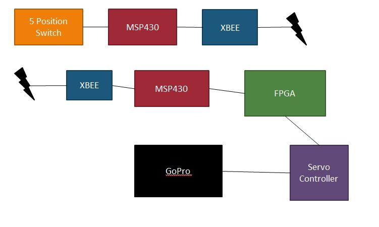

# Mobile Surveillance 

## Introduction

There has been an increase in the need for security and mobile surveillance. The GoPro has a wireless mobile application that communicates with the device. The phone shows what the GoPro sees and it can start the recording process. For this lab there are 3 levels of functionality: move the device with the FPGA buttons, move the device using a 5 position switch, and move the device wirelessly using the 5 position switch.

## Implementation

The final functionality (wireless) uses a system of servo motors, FPGA, 2 MSP430s, 2 XBee transcievers, and a 5 position switch. The following is a diagram of the implementation:

## Test/Debug

I ran into 3 main issues: 

 - Incorrect servo movement using FPGA
 - XBee transmissions
 - Incorrect pin out with the MSP430

The FPGA did not create a proper PWM signal for the servos. With the help of C1C Bryan Aragon, I was introduced to a servo controller. This controler talks to a computer and you can use sliders to move the motor to the position you want. There also is a script function where you can write a script to interface with the motors. Once again C1C Aragon helped me with the XBee transmission issue. He had extra XBees from his capstone project, but he had them programmed to take in commands then send it data. He was able to re program it to be transparant and always send data. The last major issue I had was incorrectly setting my pins as inputs instead of outputs. 

I tested my signals by the use of a voltmeter and a logic analyzer. The voltmeter helped me test my voltages produced by the voltage regulators and to test whether or not my pins were producing a '1' or a '0'. The logic analyzer was used for figuring out how and if the XBee transmissions were working. 

## DEMO

Here is a video of the project: http://www.youtube.com/watch?v=6PL8EXLx0s8&feature=youtu.be 

## Conclusion

Through this project, I learned that FPGAs aren't goof with PWM or UART without using the USB, you have to wire voltage regulators correctly, and servo controllers make life 100% better. If i were to complete this lab again I would make a better contraption and have the system contain less items.

## Documentation

In this project I recieved plenty of help from C1C Bryan Aragon, Capt Silva, and msp430 UART code from the github user [wendlers](https://github.com/wendlers/msp430-harduart).
